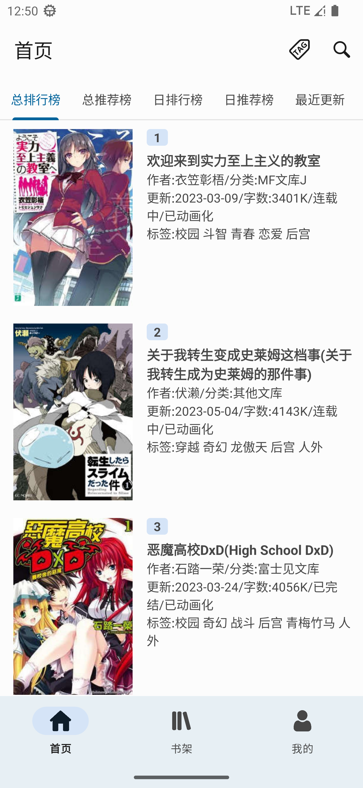
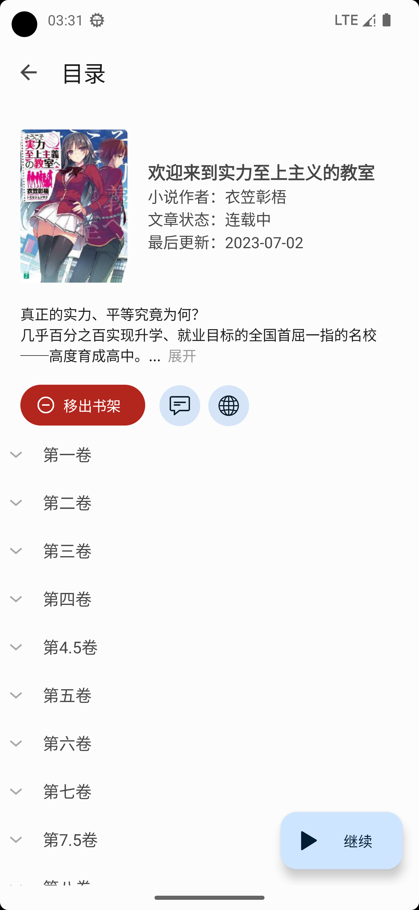
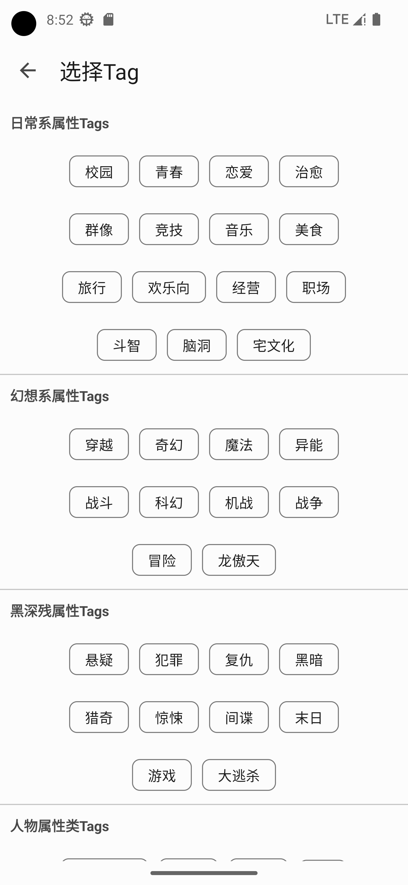
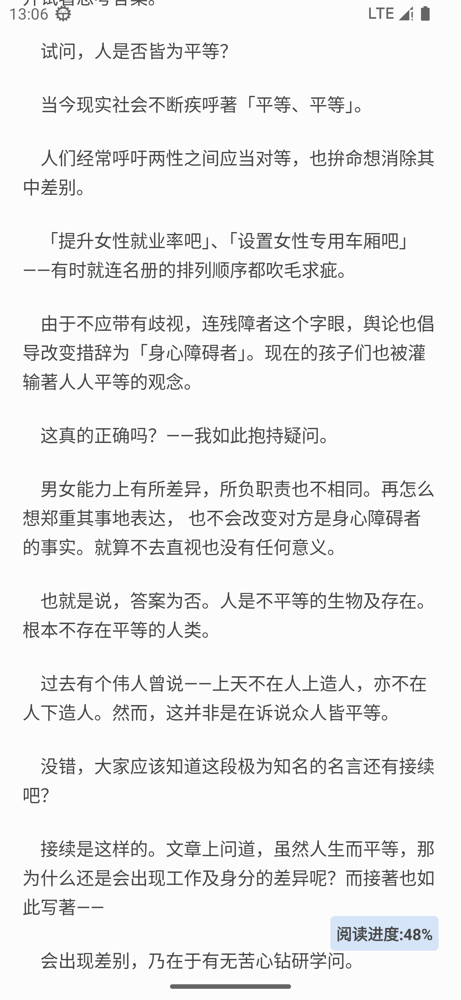
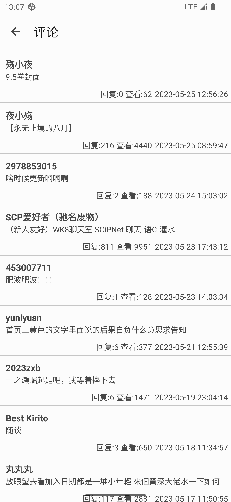

<div align="center">
  <div align="center">
    
  </div>

  <h2 align="center">轻小说文库</h2>
  <div align="center">
    一个 <b>第三方</b> 轻小说文库 <b>阅读器</b>
    <br />
    <a href="https://www.bilibili.com/video/BV1ns4y1B7J2/"><b>视频展示</b></a>
    <br />
  </div>

</div>

- 使用Material Design 3，界面简洁
- 支持阅读进度保存
## 注意
- 本软件是轻小说文库的第三方软件，本软件数据全部来自轻小说文库(www.wenku8.net)
- 支持的安卓版本：Android 10+ (API 29+)

<h2> 觉得好用别忘了star哦，你的star是对我最大的激励 </h2>

## 目录
- [安装](#安装)
- [软件截图](#软件截图)
- [代码目录结构](#代码目录结构)
- [使用的第三方库](#使用的第三方库)
- [作者的话](#作者的话)
## 安装
前往release页面下载安装

## 软件截图
| 首页                         | 目录                                 | 根据Tag搜索                                          |
|----------------------------|------------------------------------|--------------------------------------------------|
|  |  |  |

| 阅读                             | 评论                               |
|--------------------------------|----------------------------------|
|  |  |
## 代码目录结构
```
wenku8reader
│  App.java 实现MD3动态取色、数据库初始化和读取数据
│  
├─activity
│      AppActivity.java 首页界面
│      CommentActivity.java 评论界面
│      CommentInCommentActivity.java 评论回复界面
│      ContentsActivity.java 小说目录界面
│      LoginingActivity.java 开屏、等待登录完成界面
│      LoginInputActivity.java 登录和注册界面
│      PhotoViewActivity.java 查看原图界面
│      ReaderActivity.java 阅读器界面
│      SearchActivity.java 搜索界面
│      SettingActivity.java 设置界面
│      TagSearchActivity.java 按Tag搜索的界面
|      TagSelectActivity.java 选择Tag的界面
|      CrashActivity 软件崩溃界面
│      
├─adapter
│      BookCaseAdapter.java 书架adapter
│      BookListAdapter.java 小说信息adapter
│      CommentAdapter.java 评论adapter
│      CommentInCommentAdapter.java 回复adapter
│      ContentsListAdapter.java 小说目录列表adapter
│      ReaderAdapter.java 阅读器图片adapter(如果有插图的话)
│      
├─classLibrary
│      BookcaseClass.java 书架类
│      BookListClass.java 小说信息类
│      ContentsCcssClass.java 章节类
│      ContentsVcssClass.java 卷类
│      
├─fragment
│      BookCaseFragment.java 书架fragment
│      BookListFragment.java 小说信息fragment
│      HomeFragment.java 首页fragment
│      MyinfoFragment.java 我的fragment
│      ReadFragment.java 阅读器fragment
│      SearchFragment.java 搜索fragment
│      TagSearchFragment.java 按Tag搜索的fragment
│      
└─util
       CheckUpdate.java 检查更新
       loginWenku8.java 登录wenku8
       MyNestedScrollView.java 自定义NestedScrollView
       NetWorkReceiver.java 检测网络状态
       UnScrollExpandableListView.java 自定义ExpandableListView
       VarTemp.java 全局变量存放
       Wenku8Spider.java Wenku8爬虫
```
## 使用的第三方库
- org.jsoup:jsoup 解析html
- com.squareup.okhttp3:okhttp 网络数据请求
- com.github.chrisbanes:PhotoView 图片查看器
- com.github.bumptech.glide:glide 加载图片
- com.alibaba:fastjson 解析json
- com.github.youlookwhat:ByRecyclerView 上拉加载，下拉刷新
- com.github.MZCretin:ExpandableTextView 可展开和收回的TextView
- com.github.TutorialsAndroid:crashx 全局崩溃拦截

# 作者的话
本人只是个职高生，能力实在有限，所以如果有比较影响体验的bug的话请见谅。<br>
本项目是从2023.4.8开始写起来的（安卓相关知识也是从这个时候开始学习的），平常也就放学回家和周六周日的时候写这个，由于本人之前从来没有接触过安卓开发，所以这个软件都是边学边写的，难免会出现一些问题。我甚至连Java都没怎么学过，都是靠C++的语法基础的，所以看源代码的时候轻喷。<br>
很多代码都是我从网上抄的，源代码注释也有写出处。源代码中的文件夹，文件和变量名的命名都挺混乱的，请见谅。
<br><br>
我写这个软件的目的是为了适配高版本的android系统。<br>
之前一直在用其他人写的第三方软件，但是在android版本高的系统上会出现一些问题（例如安卓13），所以就自己写了一个软件。
<br><br>
软件界面的颜色配色我是直接使用了MD3的动态配色，我个人很喜欢MD3的动态配色和Material Design风格。
<br><br>
本人也在这个项目中学到了很多东西，比如class的好处（以前我都不喜欢用class的，因为没理解😂），收获也挺多的。
## 开源协议
MIT License