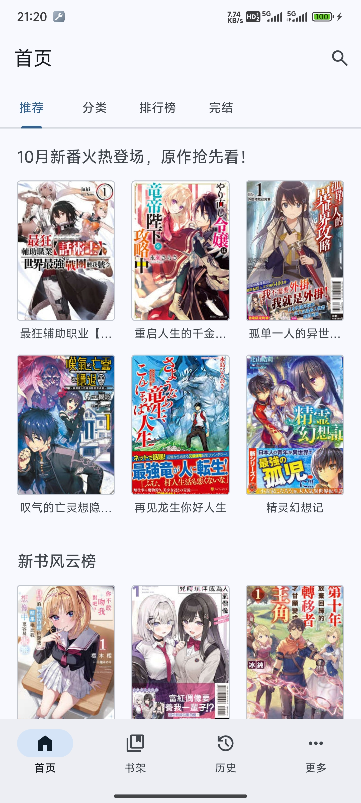
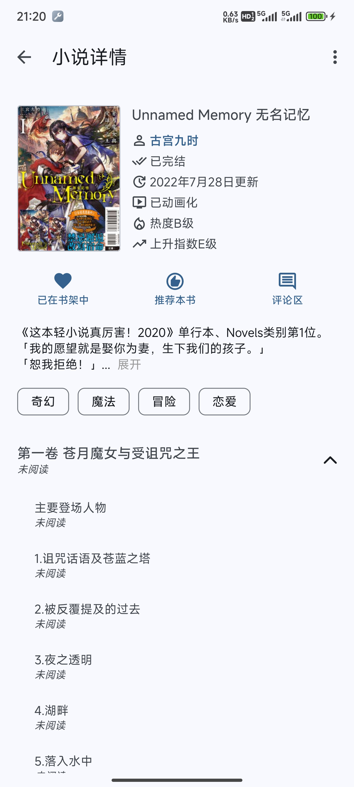
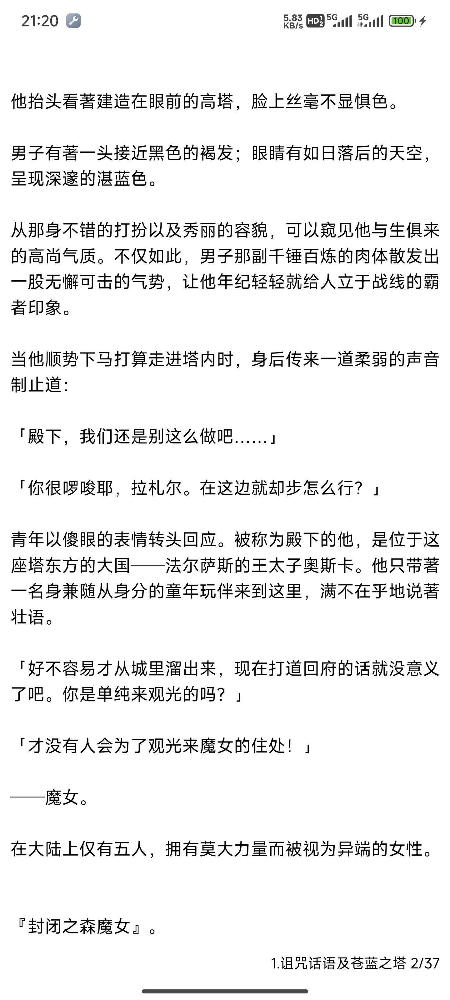
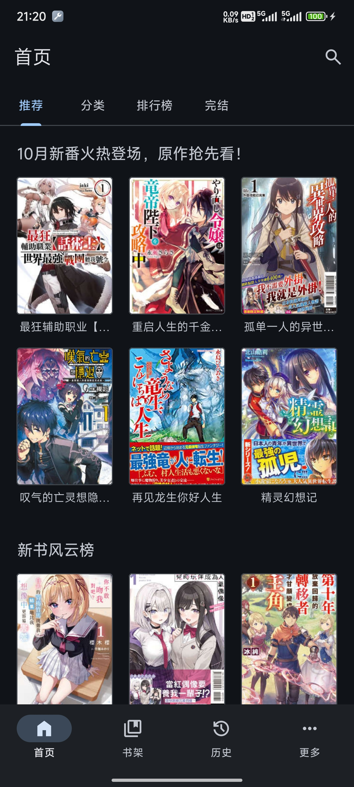
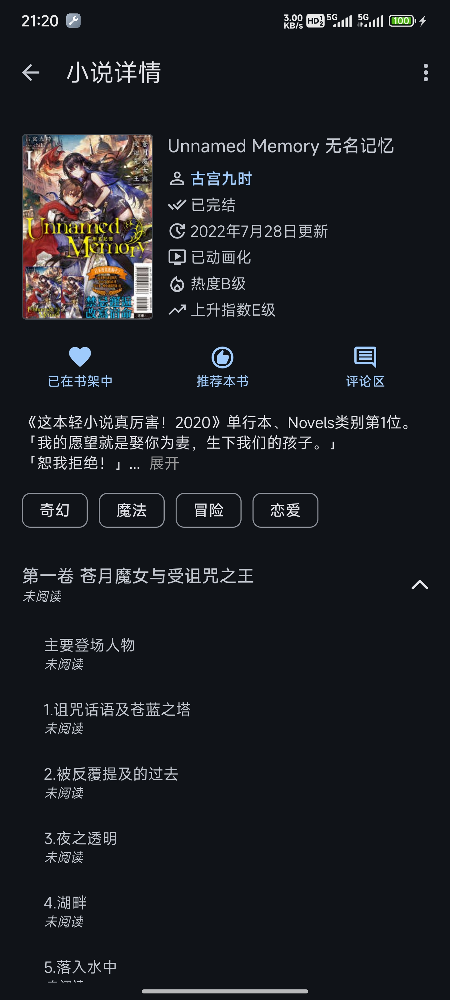
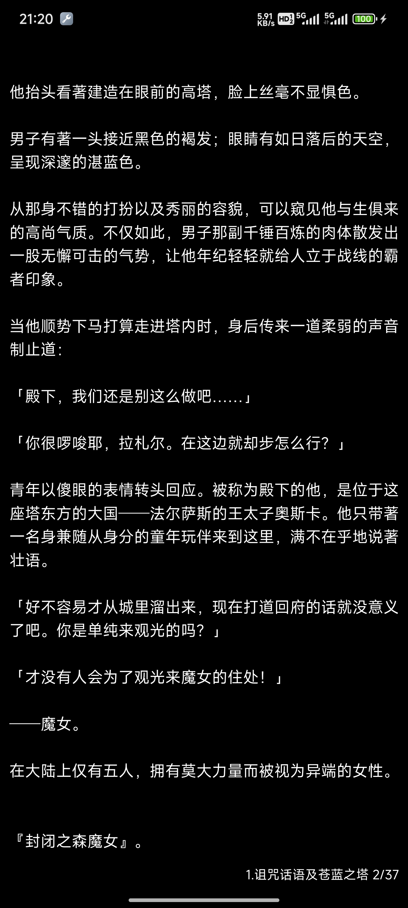

## 🚧本项目已停止更新，不再维护🚧
### 📣有能力编译Flutter项目的，可以看看我用Flutter重构的项目（[hikari_novel_flutter](https://github.com/15dd/hikari_novel_flutter)）。小白就别看了，没有安装包，要自己编译的📣
### 📢如果你不会编译的话，可以看这位的项目（[light-novel-library_Wenku8_Android](https://github.com/MewX/light-novel-library_Wenku8_Android)）📢

  

    
  

  # Hikari Novel

  

    
    
    
  

  
第三方轻小说文库客户端，使用MD3风格，更简洁，更清爽

  

> [!WARNING]\
> 本软件目前只适配了手机，未适配平板，不建议平板使用本软件！

> [!IMPORTANT]\
> 本软件是轻小说文库的第三方客户端，与轻小说文库官方无关，本软件数据全部来自[轻小说文库](https://www.wenku8.cc)以及[light-novel-library_Wenku8_Android](https://github.com/MewX/light-novel-library_Wenku8_Android)\
> 支持的安卓版本：Android 7+ (API 24+)

> [!NOTE]\
> 觉得好用别忘了star哦，你的star是对我最大的激励\

## 软件截图
- 浅色模式

  </img> </img> 

 

- 深色模式

  </img> </img> 

## 作者的闲话
  说起来你们可能不信，这软件是我一个中专生写的（刚开始写软件的时候还是中专生，现在已经是大专生了），我的编程技术不好，这一点是可以从源代码中看出来的。
   
   
  这个软件是我在23年3月开始写的，然后第一次接触了Android开发，中间就是边学边做。一放学就马上跑回家坐在电脑面前，不断地完善代码、看教程、查文档。虽然遇到不懂的地方还挺头疼的，但是总体过程还是挺开心的。历时两个月，我写出了第一个正式版，我都没想到我可以做出一个App，并且把我当时想要实现的功能全都做出来了，内心很是激动。在第一个版本发布之后，我继续学习相关知识，不断优化软件，解决大家在使用软件中的问题，然后继续发布更新至今。
   
   
  现在的v3大版本已经是经过一次大重构了，代码质量明显比之前好了，但还需要改进

## Stargazers over time
