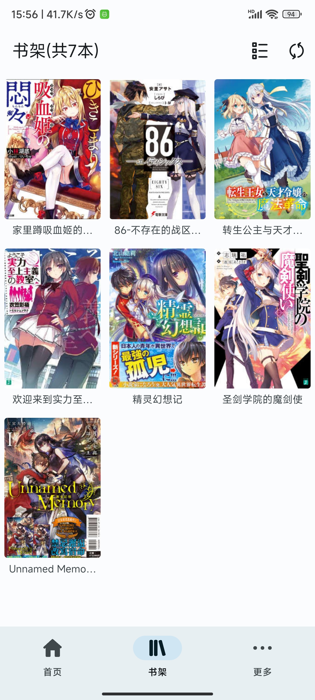
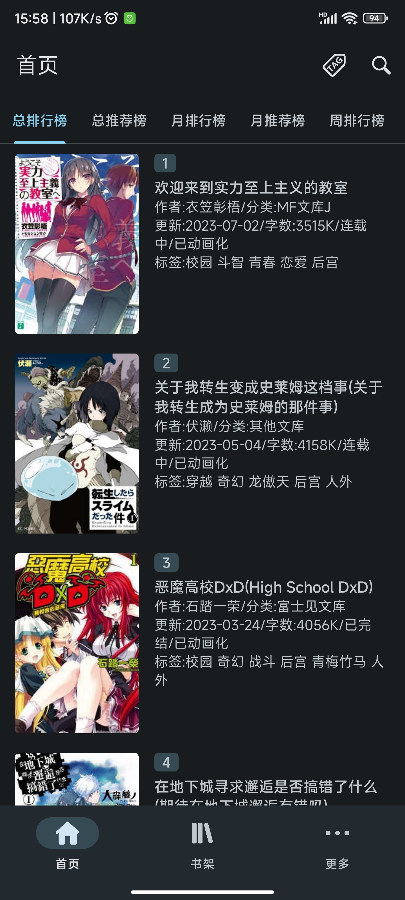
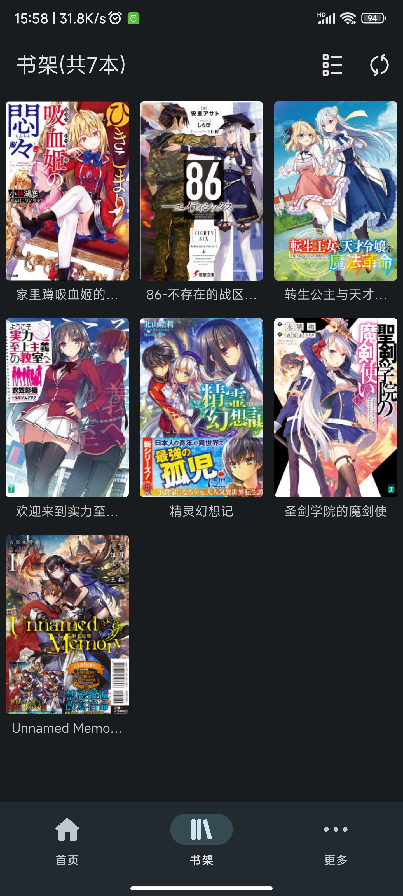

  

    
  

  # 轻小说文库

  

    
    
    
    
  

  
第三方轻小说文库客户端，使用MD3，更简洁，更清爽

## 注意
- 本软件是轻小说文库的第三方客户端，与轻小说文库官方无关，本软件数据全部来自[轻小说文库](https://www.wenku8.cc)
- <u><b>本软件不提供注册功能，请前往轻小说文库官方网站注册，[前往注册](https://www.wenku8.cc)</b></u>
- <u><b>在使用本软件的过程中，请关闭梯子，使用中国大陆的ip访问</b></u>
- 支持的安卓版本：Android 10+ (API 29+)
- 觉得好用别忘了star哦，你的star是对我最大的激励
- 欢迎加入[Telegram交流群](https://t.me/+JH2H3VpET7ozMTU9)，一起讨论本软件的功能，使用体验等

## 软件截图
- 浅色模式

  </img> </img> </img> </img> </img> 

 

- 深色模式

  </img> </img> </img> </img> </img> 

## 常见问题
- Q：为什么软件一直崩溃或者一直提示“内容为空”？ 
  A：检查网络，查看ip属地是不是中国大陆的
- Q：图片加载失败怎么办？ 
  A：长按图片查看原图

## 其他
- <h3>重构</h3>
  由于当时写这个软件的时候没什么经验，很多地方的代码连我自己都看不下去了，所以打算重构了，预计24年的暑假应该能写完
   
  当前重构进度（24.5.31）：编写阅读器中 ====>70%  
- <h3>有关源代码</h3>
  本项目一开始是用Java写的，但是我后来开始学Kotlin了，为了方便维护软件，我直接用了AS的转换功能。所以设计思想还是Java的，导致有些地方看着怪怪的，比如可以用Kotlin协程的地方却开了个Thread。还有些地方是原本的设计就有问题，我在优化代码的时候，直接把我自己给气笑了，我居然把两个毫不相关的String类型的数据放在同一个`List<String>`里，然后传给一个函数，之后用list.get()这个方法取出想要的数据，而且还有好多地方都是这么写的。虽然也不是不行，但是很难看懂，还麻烦，不好维护。这就是基础不好的后果😭，只能等后期v3.0版本重构了
- <h3>作者的闲话</h3>
  说起来你们可能不信，这软件是我一个中专生写的，并且我的编程基础还不好，Java，Kotlin都只学了些皮毛，这一点是可以从源代码中看出来的。
   
   
  这个软件是我在23年3月开始写的，然后第一次接触了Android开发，中间就是边学边做。一放学就马上跑回家坐在电脑面前，不断地完善代码、看教程、查文档。虽然遇到不懂的地方还挺头疼的，但是总体过程还是挺开心的。历时两个月，我写出了第一个正式版，我都没想到我可以做出一个App，并且把我当时想要实现的功能全都做出来了，内心很是激动。在第一个版本发布之后，我继续学习相关知识，不断优化软件，解决大家在使用软件中的问题，然后继续发布更新至今。

## 感谢
#### 第三方库
- org.jsoup:jsoup 解析html
- com.squareup.okhttp3:okhttp  网络请求
- com.github.chrisbanes:PhotoView  图片查看器
- com.github.bumptech.glide:glide  加载图片
- com.alibaba:fastjson  解析json
- com.github.youlookwhat:ByRecyclerView  上拉加载，下拉刷新
- com.github.MZCretin:ExpandableTextView  可展开和收回的TextView
- com.github.TutorialsAndroid:crashx  全局崩溃拦截
- com.github.youxiaochen:expandable-recyclerview 可展开和收回的recyclerview（用这个主要是不会与nestedscrollview发生滑动冲突）
- com.geyifeng.immersionbar:immersionbar 阅读器界面沉浸
- com.github.RickyHal:EColorPicker 颜色选择
- com.github.huburt-Hu:NewbieGuide 新手引导
- com.squareup.leakcanary:leakcanary-android 内存泄漏检测
#### 开源项目
- https://github.com/ya-b/NetNovelReader  阅读器来源
#### 软件界面灵感、参考
- https://github.com/tachiyomiorg/tachiyomi
- https://github.com/Ashinch/ReadYou
#### 其他
- https://github.com/wildma/ScreenAdaptation  根据屏幕分辨率适配组件大小（Android Studio插件）
- AI（new bing、claude）

## Stargazers over time

