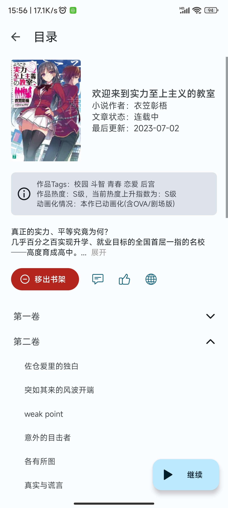
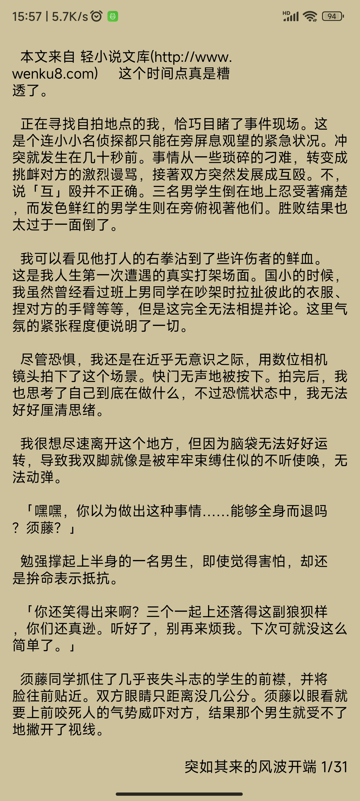
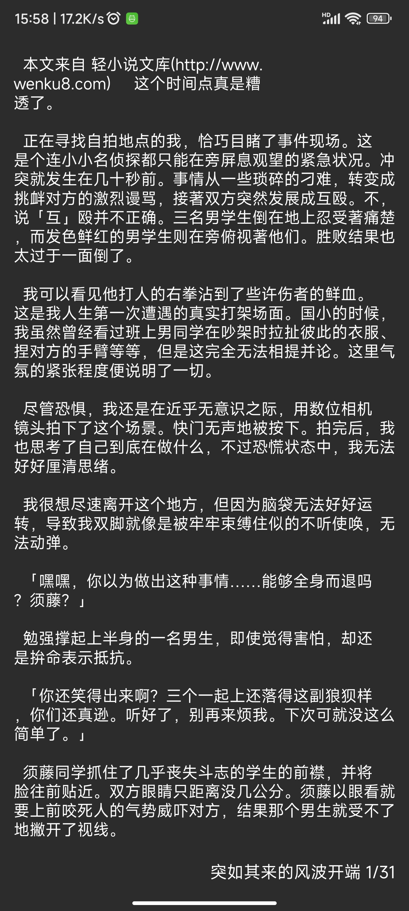

[](https://github.com/15dd/wenku8reader/releases)
# 重要事项
- <h3>软件bug请提issues，其他问题请发discussions</h3>
- <h3>本人职高三年级开学了 <s>（现在连周日都要去学校上课，这真的是职高吗？😭 IP:浙江）</s> ，项目维护和更新会非常慢</h3>
- <h3>本软件目前以维护为主，我接下来计划重写整个项目，只是不知道什么时候能搞好就是了（大约暑假的时候能搞定吧，主要是最近的休息日都在玩galgame，没什么时间）
- <h3>重构进度（2024.1.11）：学习jetpack compose和kotlin中，compose这个东西的相关教程好难找，谁能给我推荐点相关资料😭，如果有推荐的资料请发在discussions中，感谢🙏🙏</h4>

# 介绍
<div align="center">
  <div align="center">
    
  </div>

  <h2 align="center">轻小说文库</h2>
  <div align="center">
    一个 <b>第三方</b> 轻小说文库 <b>阅读器</b>
    <br />
    <a href="https://www.bilibili.com/video/BV1ns4y1B7J2/"><b>视频展示</b></a>
    <br />
  </div>

</div>

- 使用Java和Kotlin混合开发
- 使用Material Design 3，界面简洁
- 支持阅读进度保存
- 深色模式适配
## 注意
- 本软件是轻小说文库的第三方软件，本软件数据全部来自轻小说文库(www.wenku8.cc)
- 支持的安卓版本：Android 10+ (API 29+)

<h2>觉得好用别忘了star哦，你的star是对我最大的激励</h2>

## 目录
- [软件截图](#软件截图)
- [作者的话](#作者的话)
- [常见问题](#常见问题)
- [感谢](#感谢)

## 软件截图
浅色模式
<div align="left">
  </img> </img> </img> </img> </img> 
</div>

<br>

深色模式
<div align="left">
  </img> </img> </img> </img> </img> 
</div>

## 常见问题
- Q：为什么软件一直崩溃？<br>
  A：首先先看一下网络是否正常，比如没连接上网络，开了vpn之类的。或者打开浏览器访问 https://www.wenku8.cc/index.php 。如果能正常访问该网站，而且网络环境没问题的情况下还一直崩溃的话，请提一个issue，并附上报错信息、使用的版本号，以及软件是在什么情况下崩溃的说明。
- Q：图片加载失败怎么办？<br>
  A：长按图片查看原图

# 作者的话
<b>
本人只是个职高生（目前在读），能力实在有限，所以如果有比较影响体验的bug的话请谅解。
<br>
因为是职高生，所以开发新功能和解决问题的速度会比较慢，这个也请谅解。
</b>
<br><br>
在写那个阅读器时，真的花了我很多时间，在Github上找了很久，总算找到一个可以轻松使用的小说阅读器项目，但是只能显示文本，显示不了图片。于是我去修改了他的代码，但在修改的时候是真的很痛苦，首先他的代码都是kotlin写的，我还需要去学一下kotlin的语法，然后就是他使用了自定义view，这方面我根本没了解过，所以在想显示图片的代码的时候也花了很多时间，最后的方法是：写一个跟显示文本页面(PageText)差不多的自定义view，然后修改一下PageView的代码就行了。虽然之后有一些小bug，但基本都解决了。
<br><br>
在开发2.0.0版本，解决代码Error时，突然看到了Warning里的`this is a memory leak`这个消息（我之前基本不看Warning的，只要没有Error，软件能跑就行）。然后百度了一下，发现java也有内存泄漏这个情况，因为之前有听说过java有内存回收机制，以为new了一块空间出来就不用管他了。后来用leakcanary一查，确实有内存泄漏这个问题。之后就把已知的内存泄漏问题给解决了，在这期间又发现了因为系统问题导致的内存泄漏（在安卓10这个系统上会出现。这个还是AI找出来的，不然我都不知道是系统的原因），然后又解决了一些各种各样的原因导致的内存泄漏问题，算是涨了很多知识。
<br><br>
<b>
本软件是从2023.4.8开始写起来的（安卓相关知识也是从这个时候开始学习的），平常也就空闲的时候写这个，由于本人之前从来没有接触过安卓开发，所以这个软件都是边学边写的，难免会出现一些问题。我甚至连Java都没怎么学过，都是靠C++的语法基础的，所以看源代码的时候轻喷。<br></b>
很多代码都是我从网上抄的，源代码注释也有写出处。源代码中的文件夹，文件和变量名的命名都挺混乱的，请见谅。
<br><br>
我写这个软件的目的是为了适配高版本的安卓系统。<br>
之前一直在用其他人写的第三方软件，但是在安卓版本高的系统上会出现一些问题（例如安卓13），所以就自己写了一个软件。
<br><br>
软件界面的颜色配色我是直接使用了MD3的动态配色，我个人很喜欢MD3的动态配色和Material Design 3风格。
<br><br>
本人也在这个项目中学到了很多东西，比如class的好处（以前我都不喜欢用class的，因为没理解😂），收获也挺多的。

## 感谢
### 第三方库
- org.jsoup:jsoup 解析html
- com.squareup.okhttp3:okhttp  网络请求
- com.github.chrisbanes:PhotoView  图片查看器
- com.github.bumptech.glide:glide  加载图片
- com.alibaba:fastjson  解析json
- com.github.youlookwhat:ByRecyclerView  上拉加载，下拉刷新
- com.github.MZCretin:ExpandableTextView  可展开和收回的TextView
- com.github.TutorialsAndroid:crashx  全局崩溃拦截
- com.github.youxiaochen:expandable-recyclerview 可展开和收回的recyclerview（用这个主要是不会与nestedscrollview发生滑动冲突）
- com.geyifeng.immersionbar:immersionbar 阅读器界面沉浸
- com.github.RickyHal:EColorPicker 颜色选择
- com.github.huburt-Hu:NewbieGuide 新手引导
- com.squareup.leakcanary:leakcanary-android 内存泄漏检测
### 开源项目
- https://github.com/ya-b/NetNovelReader  阅读器来源
### 软件界面灵感、参考
- https://github.com/tachiyomiorg/tachiyomi
- https://github.com/Ashinch/ReadYou
### 其他
- https://github.com/wildma/ScreenAdaptation  根据屏幕分辨率适配组件大小（Android Studio插件）
- AI（new bing、claude）

## Star History

<a href="https://star-history.com/#15dd/wenku8reader&Date">
  <picture>
    <source media="(prefers-color-scheme: dark)" srcset="https://api.star-history.com/svg?repos=15dd/wenku8reader&type=Date&theme=dark" />
    <source media="(prefers-color-scheme: light)" srcset="https://api.star-history.com/svg?repos=15dd/wenku8reader&type=Date" />
    
  </picture>
</a>


## 开源协议

```
MIT License

Copyright (c) 2023 cyh128

Permission is hereby granted, free of charge, to any person obtaining a copy
of this software and associated documentation files (the "Software"), to deal
in the Software without restriction, including without limitation the rights
to use, copy, modify, merge, publish, distribute, sublicense, and/or sell
copies of the Software, and to permit persons to whom the Software is
furnished to do so, subject to the following conditions:

The above copyright notice and this permission notice shall be included in all
copies or substantial portions of the Software.

THE SOFTWARE IS PROVIDED "AS IS", WITHOUT WARRANTY OF ANY KIND, EXPRESS OR
IMPLIED, INCLUDING BUT NOT LIMITED TO THE WARRANTIES OF MERCHANTABILITY,
FITNESS FOR A PARTICULAR PURPOSE AND NONINFRINGEMENT. IN NO EVENT SHALL THE
AUTHORS OR COPYRIGHT HOLDERS BE LIABLE FOR ANY CLAIM, DAMAGES OR OTHER
LIABILITY, WHETHER IN AN ACTION OF CONTRACT, TORT OR OTHERWISE, ARISING FROM,
OUT OF OR IN CONNECTION WITH THE SOFTWARE OR THE USE OR OTHER DEALINGS IN THE
SOFTWARE.
```
